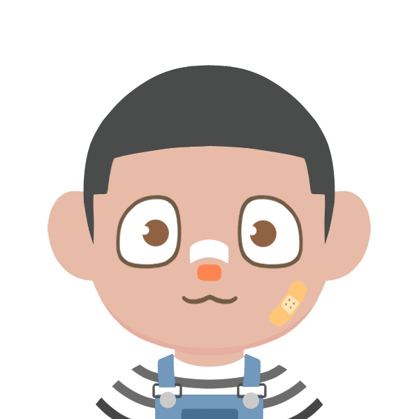

<h1>Landasan</h1>

**pada** awal tahun 2020, kami mulai disiplin untuk membuat projek yang terkait keamanan siber, sistem jaringan, serta pemrograman. **belakangan** ini, kami memiliki keinginan yang besar untuk mendokumentasi seluruh kegiatan, tugas, serta informasi yang didapatkan, dalam format yang lebih terstruktur untuk dapat didistribusikan ke masyarakat secara lebih baik


<h2>visi</h2>

**mewujudkan** organisasi yang mewadahi kreasi, inovasi, serta prestasi pada bidang sistem informasi dan keamanan siber 
<--->
<h2>misi</h2>

**mendukung** serta menyalurkan minat dan bakat untuk berkontribusi dalam berorganisasi, terutama pada sisi publikasi


<h2 align="center" style="margin: 16px 0px;">bastion</h2>

<strong>berikut</strong> merupakan seluruh kawan yang ikut membantu dalam membangun organisasi ini untuk dapat berfungsi sebagaimana yang diimpikan. bergabung <a href="https://forms.gle/oxqe22JCfiWBu87E7">disini</a> 👈

	
	
	
		

<h1 style="margin: 32px 0px 16px;">JKT ッ ID</h1>

**U** 6°17'1.746" | **B** 106°48'17.507"  
<strong>hotpotcookie</strong>@proton.me 
[🐱 lnkdn](https://www.linkedin.com/company/hotpotcookie/) 
[🐦 twttr](https://twitter.com/itshotpotcookie)
[🐨 ytb](https://www.youtube.com/channel/UCYF37a-4I8r3R_CQ99uxw-A)
[🐡 nstgrm](https://www.instagram.com/hotpotcookie/)

---